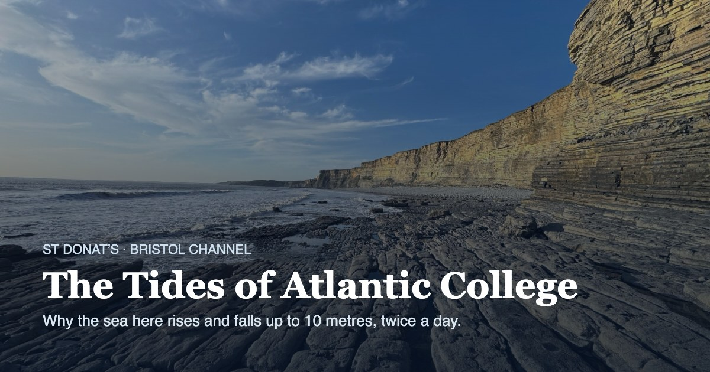

# The Tides of Atlantic College

An interactive scrollytelling explainer on why the sea at St Donat's, on the Bristol Channel, rises and falls by up to 10 metres twice a day.

Created and produced by [Jaya Ramchandani](https://welearnwegrow.bio/) in collaboration with Claude Design.



## What it covers

The piece follows a single question, *how do tides work?*, through a sequence of photographs and hand-drawn diagrams:

1. **The coast** – the rock platform at St Donat's, exposed at low tide and gone six hours later.
2. **The Moon** – gravity, Newton's law, and how the tidal force stretches the oceans into two bulges.
3. **The lunar day** – why high tide arrives about 50 minutes later each day.
4. **The Sun** – spring and neap tides, and the 14.8-day beat between two rhythms.
5. **The channel** – how the Bristol Channel's funnel shape amplifies a 2 m ocean tide to nearly 10 m.
6. **The slipway** – shallow water, and why the flood is faster than the ebb.
7. **Where the model stops** – a note on accuracy and what the model leaves out.

A live tide graph along the bottom of the screen builds up as you scroll, from the Moon alone (M₂), to the Moon and Sun together (M₂ + S₂), to the shallow-water overtide (M₄).

## Running it

It's a static site, so there's no build step and nothing to install.

- **Locally:** open `index.html` in a browser. If a browser blocks local files, serve the folder instead:
  ```bash
  npx serve .
  # or
  python3 -m http.server
  ```
- **Online:** upload the whole folder to any static host (Netlify, GitHub Pages, Cloudflare Pages, or your own server). `index.html` is the entry point.

## Files

```
index.html            the page: markup, styles, loader, meta tags
sketch.js             hand-drawn diagrams (Earth, Moon, Sun, orbits, channel, slipway)
graph.js              the tide graph and harmonic model
tides.js              scroll controller and keyframes for each section
photos/               photographs of St Donat's and the Bristol Channel
icons/                favicons, web app manifest, social share image
```

### Icons

| File | Purpose |
|---|---|
| `favicon.ico` | Classic favicon (16, 32 and 48 px) |
| `favicon.svg` | Scalable favicon for modern browsers |
| `favicon-16x16.png`, `favicon-32x32.png` | PNG fallbacks |
| `apple-touch-icon.png` | iOS home screen (180 px) |
| `android-chrome-192x192.png`, `-512x512.png` | Android and web app icons |
| `site.webmanifest` | Web app manifest |
| `og-image.jpg` | Social share image (1200 × 630) |

## Live site

The piece is live at **[https://welearnwegrow.github.io/actides/](https://welearnwegrow.github.io/actides/)**.

The share image, canonical URL and `og:url` already point to this address. If the site ever moves, update them in `index.html`.

## Moving to a new address

Facebook, LinkedIn, WhatsApp and X only show the share image if its address is a full URL. To point the site at a new address:

1. In `index.html`, replace `https://welearnwegrow.github.io/actides/` with the new address everywhere it appears: the `og:image`, `twitter:image`, `og:url` and canonical tags, and the JSON-LD block. For example:
   ```
   https://your-domain.com/icons/og-image.jpg
   ```
2. Check the preview with the [LinkedIn Post Inspector](https://www.linkedin.com/post-inspector/) or the [Facebook Sharing Debugger](https://developers.facebook.com/tools/debug/).

## About the tide model

The graph is a simplified harmonic prediction built from three constituents:

| Constituent | Cause | Period | Amplitude |
|---|---|---|---|
| M₂ | Moon | 12 h 25 min | 3.52 m |
| S₂ | Sun | 12 h 00 min | 1.30 m |
| M₄ | Shallow-water overtide | 6 h 12 min | 0.28 m |

The amplitudes are illustrative values, fitted to the spring range (about 9.5 m) and neap range (about 4.3 m) published for Llantwit Major and Nash Point. They are not official UKHO harmonic constants. Heights are plotted as displacement from mean sea level, so they won't match tide tables, which give height above chart datum.

The model leaves out the Moon's elliptical orbit, the daily inequality, weather and storm surge, the age of the tide, and the higher shallow-water harmonics. The last section of the piece explains each of these.

## Further reading

- [Tide Forecast – Llantwit Major](https://www.tide-forecast.com/locations/Llantwit-Major/tides/latest): live tide predictions near the College
- [Theory of tides](https://en.wikipedia.org/wiki/Theory_of_tides) on Wikipedia

## Credits

- **Concept, writing and photography:** [Jaya Ramchandani](https://welearnwegrow.bio/)
- **Design and build:** in collaboration with Claude Design
- **Tide data:** fitted to published predictions for Llantwit Major and Nash Point
- **Libraries:** [Rough.js](https://roughjs.com/) for the hand-drawn diagrams; Playfair Display, Inter and Caveat from Google Fonts
